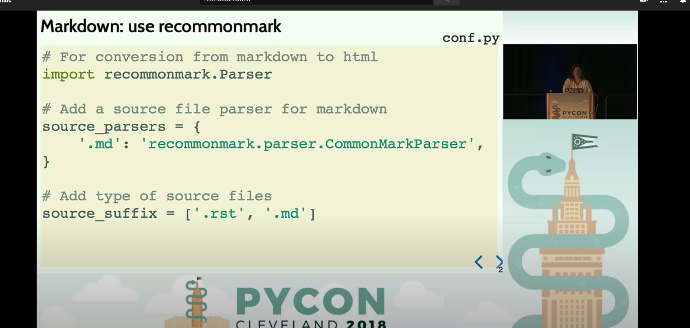

=====
Title
=====
Subtitle
--------
Titles are underlined (or over-
and underlined) with a printing
nonalphanumeric 7-bit ASCII
character. Recommended choices
are "``= - ` : ' " ~ ^ _ * + # < >``".
The underline/overline must be at
least as long as the title text.

A lone top-level (sub)section
is lifted up to be the document's

Enumerated lists:

3.  This is the first item

4.  This is the second item

5.  Enumerators are arabic numbers,
    single letters, or romasn numerals

6.  List items should be sequentially
    numbered, but need not start at 1
    (although not all formatters will
    honour the first index).

#.  This item is auto-enumerated

Definition lists:

what
    Definition

how
    The term

:Authors:
    Yangyang Li
    Yuezhu

:Version: 1.0 of 2020
:Dedication: To my father

-a              command-line option "a"

-b              file

--long

--input=file

/v

**Bold**

::

    whitespace, **Bold**

**Bold**

Per-line quoting can also be used on
unindented literal blocks::
> Useful for quotes from email and
> for Haskell literate programming.

Doctest blocks are interactive
Python sessions. They begin with
"``>>>``" and end with a blank line.

>>> print "This is a doctest block."
This is a doctest block.

Plain text	Typical result
Grid table:

+------------+------------+-----------+
| Header 1   | Header 2   | Header 3  |
+============+============+===========+
| body row 1 | column 2   | column 3  |
+------------+------------+-----------+
| body row 2 | Cells may span columns.|
+------------+------------+-----------+
| body row 3 | Cells may  | - Cells   |
+------------+ span rows. | - contain |
| body row 4 |            | - blocks. |
+------------+------------+-----------+

Citation labels contain alphanumerics,
underlines, hyphens and fullstops.
Case is not significant.

Given a citation like [this]_, one
can also refer to it like this_.

.. [this] here.

For instance:

